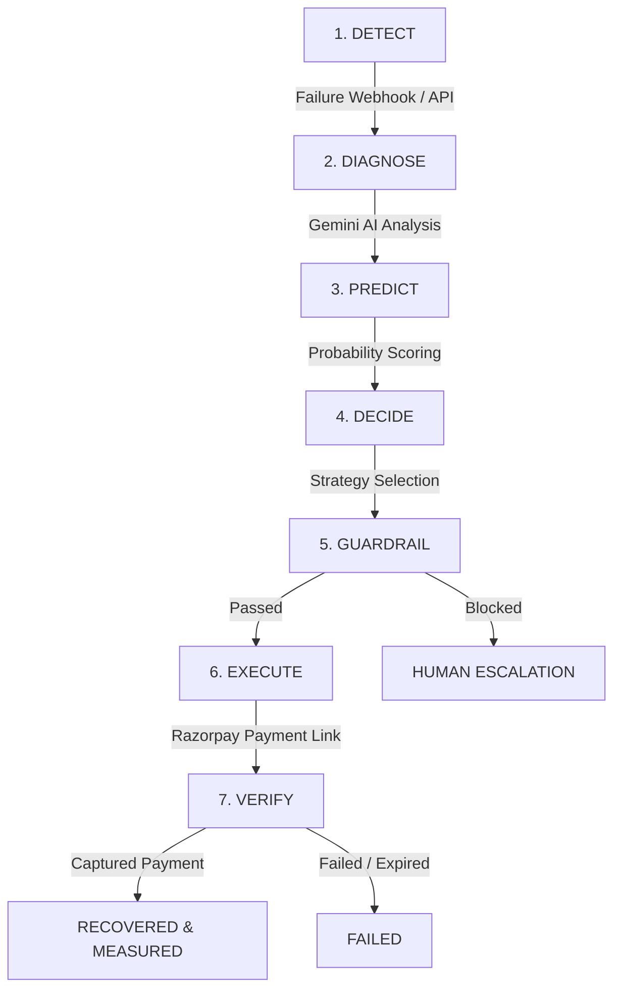

# ReclaimAI — Autonomous Revenue Recovery Platform

> **Razorpay Buildathon — Track 03: AI Revenue Recovery**  
> *Find revenue that’s slipping away and win it back autonomously.*

[](https://fastapi.tiangolo.com/)
[](https://nextjs.org/)
[](https://ai.google.dev/)
[](https://razorpay.com/)
[](https://supabase.com/)

---

## 🌟 Executive Summary

Every year, digital businesses in India lose over **15% of valid revenue** to payment failures, transient UPI network timeouts, issuing bank soft declines, and abandoned checkout flows. Retrying blindly annoys customers, increases risk scores, and gets card tokens blocked.

**ReclaimAI** is an agentic, closed-loop revenue recovery platform powered by **Google Gemini 2.5** and **Razorpay Core APIs**. When a payment fails or a checkout drop-off occurs, ReclaimAI immediately catches the webhook, diagnoses the root cause, evaluates safety guardrails, issues dynamic Razorpay Payment Links, and authoritatively measures exact recovered rupees back into the merchant’s account.

---

## ⚙️ Architecture & The 7-Node Autonomous Loop

ReclaimAI operates on a strict **7-Node Stateful Agent Machine** implemented with LangGraph:



### The 7 Agent Nodes Explained

1. **`DETECT`**: Listens to Razorpay webhooks (`payment.failed`, `payment_link.expired`). Ingests transaction context (amount, customer, failure reason, method).
2. **`DIAGNOSE`**: Queries Gemini 2.5 Flash to analyze the failure reason (e.g., distinguishing transient UPI timeouts vs issuing bank hard declines).
3. **`PREDICT`**: Calculates recovery probability based on historical payment method success rates and customer retry counts.
4. **`DECIDE`**: Recommends the precise intervention strategy (`Smart Retry`, `Personalized Reminder`, `Card Update Request`, or `Wait`).
5. **`GUARDRAIL`**: Enforces strict policy validation:
   - **Amount Threshold**: Transactions $> \text{₹}50,000$ require human approval (`action_required`).
   - **Retry Count Limit**: Maximum 2 automated retries before human escalation (`escalated`).
   - **Minimum Probability**: Probability $< 30\%$ skips automated action (`no_action`).
6. **`EXECUTE`**: Interacts with Razorpay API to issue dynamic Payment Links (`plink_xxx`) tagged with the original `recovery_case_id`.
7. **`VERIFY`**: Queries Razorpay API/Webhooks to check if status changed to `paid`/`captured`. Authoritatively measures exact rupees recovered using exact `Decimal` arithmetic.

---

## 🚀 Key Features & Competitive Edge

* **Authoritative Gateway Measurement**: A recovery case is **ONLY** measured as recovered when Razorpay returns `status == "captured"`. Payment links in `created` state do not count until customer payment succeeds.
* **Zero-Float Financial Precision**: Converts Razorpay paise to Indian Rupees (`INR`) using exact `Decimal` arithmetic (0.01 INR precision) rather than floating-point math.
* **Deep Razorpay Integration**: Native support for Razorpay Payment Links API and Webhook event processing (`payment.failed`, `payment.captured`, `payment.authorized`, `payment_link.cancelled`, `payment_link.expired`).
* **Fully Mobile Responsive Command Center**: Built with Next.js 16, TailwindCSS, and Lucide icons featuring a mobile slide-out drawer, touch-scrollable tables, and live analytics.
* **Batch Recovery Engine**: Run automated or single-click batch recovery across hundreds of cases with complete audit trails.

---

## 🛠️ Project Structure

```text
Razorpay/
├── backend/                  # FastAPI Python backend
│   ├── app/
│   │   ├── agents/           # LangGraph 7-node recovery agent
│   │   ├── api/              # REST Endpoints (recovery, agent, payment_links, webhooks)
│   │   ├── services/         # Razorpay SDK, Gemini client, DB service, State machine
│   │   ├── config.py         # Environment configuration
│   │   └── main.py           # FastAPI entrypoint & CORS middleware
│   ├── tests/                # 68 Pytest unit & integration tests
│   └── requirements.txt      # Dependencies (google-genai, razorpay, supabase, etc.)
├── frontend/                 # Next.js 16 Web Application
│   ├── src/
│   │   ├── app/              # App router pages (dashboard, recovery-cases, payment-links, etc.)
│   │   ├── components/       # UI components & Landing page sections
│   │   └── lib/              # API client & formatting utilities
├── RECLAIMAI_DETAILED_DOCUMENTATION.md  # Architectural deep-dive
└── README.md
```

---

## ⚡ Quickstart & Local Setup

### 1. Prerequisites
* Python 3.11+
* Node.js 18+
* Razorpay Test Mode API Keys
* Supabase PostgreSQL Database

### 2. Backend Setup
```bash
cd backend
python -m venv .venv
source .venv/bin/activate  # On Windows: .venv\Scripts\activate
pip install -r requirements.txt

# Start FastAPI server
uvicorn app.main:app --host 0.0.0.0 --port 8000 --reload
```

### 3. Frontend Setup
```bash
cd frontend
npm install

# Start Next.js development server
npm run dev
```

Visit `http://localhost:3000` in your browser.

---

## 🔑 Environment Variables

### Backend (`backend/.env`)
```env
GEMINI_API_KEY=your_gemini_api_key
RAZORPAY_KEY_ID=rzp_test_TUJXFQmh09bS86
RAZORPAY_KEY_SECRET=your_razorpay_secret
RAZORPAY_WEBHOOK_SECRET=your_webhook_secret
SUPABASE_URL=https://your-supabase-url.supabase.co
SUPABASE_SERVICE_ROLE_KEY=your_supabase_service_role_key
FRONTEND_URL=http://localhost:3000
```

### Frontend (`frontend/.env.local`)
```env
NEXT_PUBLIC_API_URL=http://localhost:8000  # Or https://razorpay-6vlo.onrender.com
NEXT_PUBLIC_SUPABASE_URL=https://your-supabase-url.supabase.co
NEXT_PUBLIC_SUPABASE_ANON_KEY=your_supabase_anon_key
NEXT_PUBLIC_RAZORPAY_KEY_ID=rzp_test_TUJXFQmh09bS86
```

---

## 🧪 Testing

Run the backend test suite:
```bash
cd backend
python -m pytest
```
*68 tests passed, 0 failed.*

---

## 📄 License
Built for the Razorpay Buildathon 2026. Distributed under the MIT License.